# VeganDirect

Vegan Direct is an online retail shop selling innovative, high-quality vegan food products to individual consumers (B2C) from brands and producers which are not commonly stocked in supermarkets.  

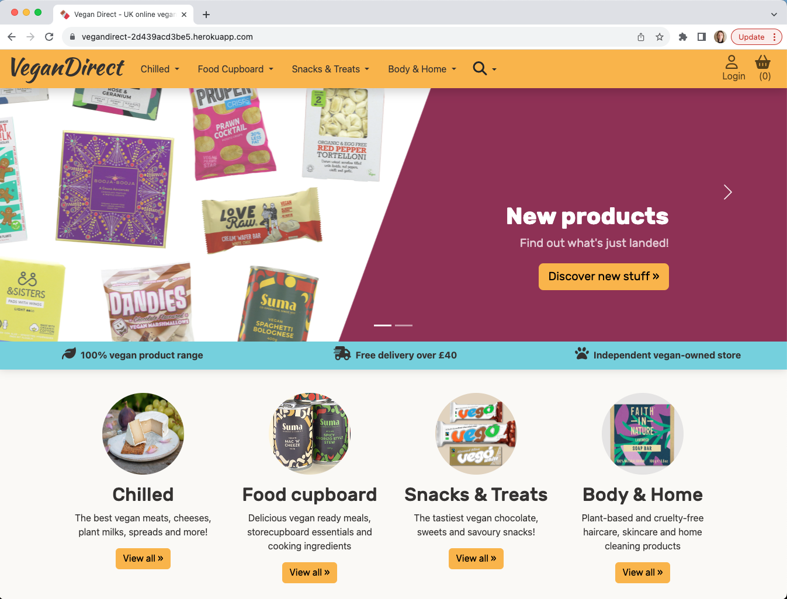

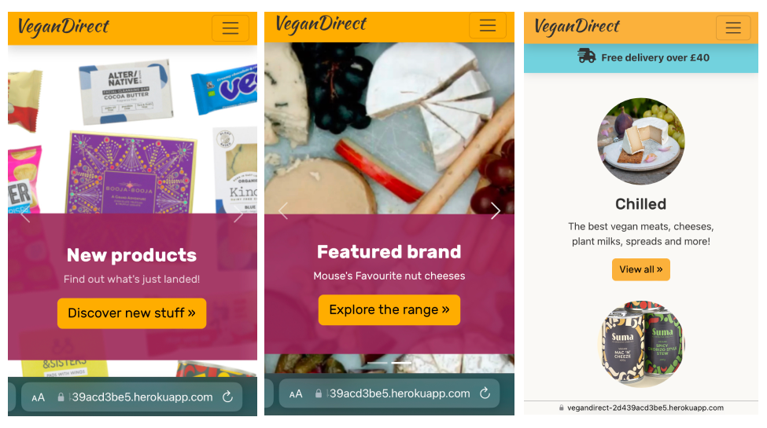

The deployed site can be accessed on Heroku: [VeganDirect on Heroku](https://vegandirect-2d439acd3be5.herokuapp.com/)

## About VeganDirect

### Purpose and benefits of the business

VeganDirect offers its customers:

**Choice and convenience**

It enables its customers to have access to a wide range of products that is more varied than the usual big brands stocked by the big supermarket chains, all in one place, and delivered to their door. 

**Ethical shopping**

Many of the products are made by small companies or sole traders, who are often vegans themselves, meaning customers are able to spend their money supporting small businesses that share their ethical values. 

**High-quality products**

Because many of the products are produced in small batches and do not have to contain the array of food additives and preservatives required to make a product long-life and durable enough to withstand a centralised supermarket supply chain, they are often of higher quality than typical supermarket products, and some are even of a handcrafted, artisan nature.

**Help achieving lifestyle goals**

People who have decided to become vegan, or are considering becoming vegan, often seek out alternatives to a particular favourite food that they are worried about missing. Vegan Direct enables them to find a wider selection of good-quality vegan food products than in their local supermarket, and locate specific alternatives to a favourite non-vegan food or ingredient, helping them to achieve their goal of maintaining a vegan lifestyle without having to ‘give up’ favourite foods.

### Target audience

VeganDirect's target audience is:

**UK-based…**

The site is based in the United Kingdom and ships solely within this area (as the practicalities of shipping chilled/frozen goods overseas and the complexity and cost of shipping from the UK into the EU since Brexit are now sadly outside the scope of a small business).  

**…individual retail customers…**

VeganDirect is a B2C (business-to-customer) retailer, selling single items directly to private customers, rather than in wholesale quantities to other retailers or caterers.

**…with an interest in vegan food**

This could include:
-	People who are already vegan
-	People who are interested in making the change to become vegan
-	People purchasing food or gifts for vegan friends, family members or colleagues
-	People who purchase ‘free-from’ foods for other reasons, such as food intolerances

## Business and customer goals

In designing any product, we must always bear in mind, who are our end users and what will be useful to them?

This section addresses the first two planes of UX design: Strategy and Scope.

The Strategy plane of UX design tells us that the product we’re designing should be useful, useable and valuable.

The product goals come under the Strategy plane of UX design: what we are aiming to achieve in the first place and for whom?  The features based on these goals are within the Scope plane of UX design: based on the goals of the business, what features should the design include?

The goals of the customer and the retailer are summarised here under the five Epics used in the development of this product.

Some are only relevant to retailers, and some are relevant to both groups.

(Note that the user who is purchasing items from the webshop is referred to throughout this document as the 'customer', although in software development terms, the customer of the software developer would be the retailer.)

### Epic 1: UX/UI

**Retailer**
1. An interface that is intuitive to use and doesn't require busy store owners to spend a long time learning how to use it

**Customer**

2. Easily find their way around an Intuitive interface
3. Enjoy using a visually attractive interface that makes the site feel trustworthy
4. Easy to find the products they want and view information about those products

### Epic 2: User Authentication and Accounts

**Retailer**

1. User has an account for the back end of the application which they can log into to add, edit and delete products from their database
2. Differing levels of permissions for the store owner and for any employees if required
3. User can clearly see who is logged in, or whether or not they are logged in, at any given time

**Customer**

4. User can sign up for an account which they can log in and out of
5. User can input all the details needed for shipping
6. Account should save their shipping details for next time if requested by the user
7. Account could allow for extended features such as loyalty points and favourite products lists
8. User can check out without creating an account
9. User can create an account by signing in with their social media account

### Epic 3: CRUD (create, view, update and delete) functionality

**Retailer**

1. Ability to add new product information
2. Ability to edit and delete existing products

### Epic 4: Basket/Purchasing

**Retailer**

1. Set shipping costs and communicate these to the customer before they make a purchase (especially if there are different rates for chilled products etc).
2. Communicate to the customer that their shipping address needs to be in the UK to make a purchase.


**Customer**

Ability to:
3. Add products to their shopping basket
4. Provide all the details needed for shipping
5. Submit their order and pay securely

### Epic 5: Marketing

**Retailer**

1. Be able to upsell, by highlighting specific products on the homepage and through a 'products you may also like' section at the bottom of individual product pages
2. Encourage customers to sign up for their social media feeds and email list
3. Encourage return visits through loyalty points and favourites lists

## User Stories

These epics and goals were then broken down into User Stories, which each have 
tasks and acceptance criteria, which were used to guide the development of this
project.  

The User Stories (plus their tasks and acceptance criteria) can be viewed on the 
project's [GitHub Project Board](https://github.com/users/charleymroberts/projects/4/views/1).

The User Stories, including those which did not make it into this iteration of the development cycle,
can also be [viewed on a Google Sheet here](https://docs.google.com/spreadsheets/d/1NterIj0KVUP2ewTUQz0VWNVGJCWMlNIqcNa3cIOfBlU/edit?usp=sharing).

(To avoid duplication, the user stories are written from the perspective of the person 
primarily carrying out the action, which in some cases is the retail customer and 
in some cases is the webshop owner, even though many actions are relevant to both groups.)

## Database design

The database models were planned using an Entity Relationship Diagram:

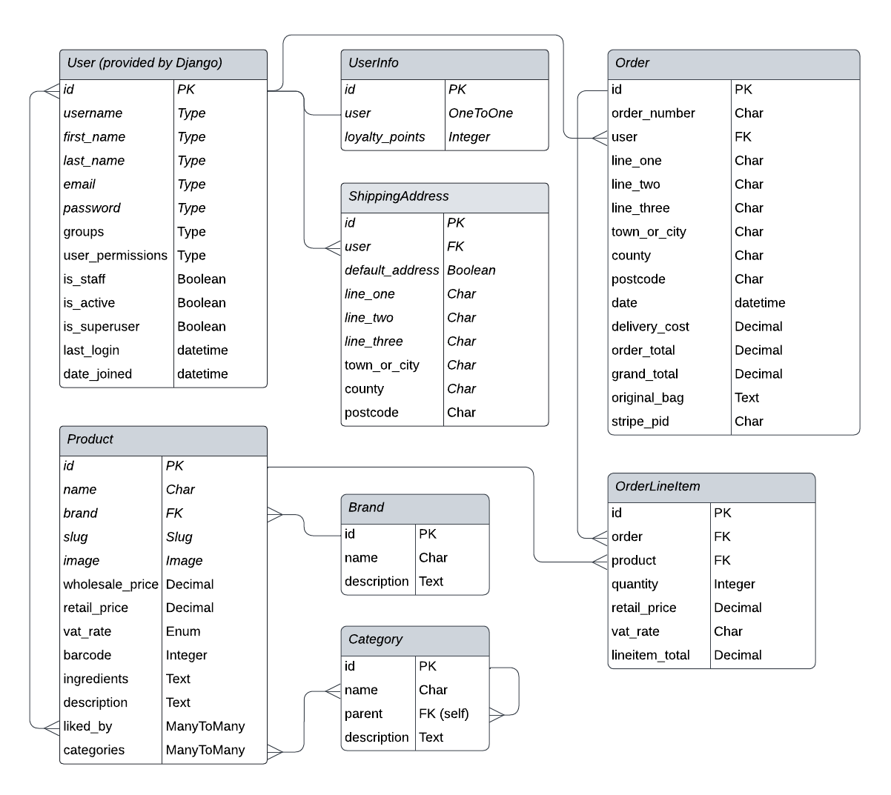

**Apps and Models**

| Django App                    | Model |
|-------------------------------|--------------|
| Checkout                      | Order, OrderLineItem |
| Products                      | Product, Category, Brand |
| Profiles (customer accounts)  | ShippingAddress, UserInfo 

The 'User' model is the standard model already provided by Django. The rest are custom models created for this project.

(UserInfo was not yet used by the time of deployment of the MVP - in future this could be used to store customer loyalty points earned with each purchase.)

**More detail about the ERD**

**User** 

The standard user model provided by Django

Relationships to other models:

OneToOne with UserInfo to extend User (UserInfo is currently only used to store loyalty points data,  but could have other information added to it in future)

**ShippingAddress**

Included as its own model so that each user can save multiple shipping addresses (home, work, etc)

Relationships to other models:

Includes ForeignKey (i.e. one to many) of User (one user can have multiple addresses)

**Product**

Information about each individual product

Relationships to other models:

ForeignKey to Brand (one brand can have many products)
ManyToMany between ‘liked’ and User (so that each user can have a list of favourite products)
ManyToMany to Category (each category contains multiple products, and each product can be assigned to multiple categories)

**Brand**

The name of each brand plus an optional description to appear on the webshop

**Category**

Determines where the product appears in the site’s navigation menus.
The name of each category plus an optional description to appear on the webshop
‘Parent’ is used to assign the category as the parent category of a subcategory (e.g. Chilled > Dairy Alternatives > Vegan Cheese – Chilled is the parent category of Dairy Alternatives, which itself is the parent of Vegan Cheese)

**Order**

Information about each order placed by a user, which is saved as an order history (i.e. so if the price of a product changes or the user changes their address, the information in their order history is not altered)

Relationship to other models:

Includes ForeignKey of User (one user can have multiple orders)

**OrderLineItem**

Each item (or multiple quantites of the same item) in a customer’s order

Relationship to other models:

Includes ForeignKey of Product (one product can be included in multiple orders) 
Includes ForeignKey of Order (multiple lines can be in one order)

Database design is related to the Structure plane of UX Design: how we structure and present our information.  Further aspects of Structure are covered below under the user interface design.

## UX/UI design

An excellent user interface design and user experience are particularly crucial for a retail business, as their customers have a choice about where they buy products from and can easily choose to go elsewhere (unlike, say, interacting with the Government or the NHS online where you have no choice but to use whatever interface is presented to you). 

### First of all

**Some guiding principles of retail that were used in the planning of this design:**

- If online customers can’t quickly find what they want, they will navigate away and look elsewhere 

Address by: making sure search, filters and category layout are effective and make it easy to find information

- If you offer customers too much choice, it can get overwhelming and they might not make a purchase 

Address by: Don’t over-clutter things. Online supermarkets tend to be bad for this, especially on home pages.

- There are two main ways to increase sales: increase the number of customers, and increase the amount of items each customer buys per visit 

Incresing the number of customers: consider SEO at all stages. 

Increasing the spend per visit: 
find ways to upsell, such as the 'similar products you might like' section suggesting 
additional products at the bottom of product pages

### Market research

I began my planning by visiting other similar online shops and supermarkets, to
familiarise myself with UI conventions and likely customer expectations.

These included:
- [Holland and Barrett](https://www.hollandandbarrett.com/) (UK-based 'health store' chain)
- [VeganStore.co.uk](https://www.veganstore.co.uk/) (the UK's original vegan online shop)
- [AlternativeStores.co.uk](https://alternativestores.com/) (another well-known vegan online store)
- [Morrisons.com](https://groceries.morrisons.com/webshop/startWebshop.do) and [Sainsburys.co.uk](https://www.sainsburys.co.uk/) for the conventional supermarket experience

Design features that are common across these online food shops/supermarkets include:

Header:
-	Company's name/logo
-	Modern-looking icons in the top right corner for favourites, account, basket etc.
-	Search box (or sometimes this is lower down the page under the banner image)

Homepage:
-	Big colourful banner image on homepage (could be carousel or static)
-	Extra info banner: e.g. saying how much to order for free delivery
-	Lists of products underneath the homepage banner (often too many in my opinion, the customer is unlikely to scroll that far down below the fold. Amazon does it though, so it’s expected.)

Menu bar (on all pages):
- Top level menu items which group products in an obvious way, including ‘new’, ‘sale/clearance’ as well as product categories

Individual product pages:
- Breadcrumb menu trail across the top on some
- Key info at top: usually half a row for product photo and the other half for name/price/add to basket
- Other info below that, sometimes with accordion sections or tabs
(there’s a lot that has to be provided, especially with food products, so it’s a good idea to make it more manageable)

Product list pages:

- Banner across the top displaying the name of the category, or the category name in bold
- Either above or below banner image: dropdown menu for 'sort by' a-z, price low-high
- ‘Filter by’ box on left hand side: e.g. category, brand, price, allergens
- Products displayed in a grid layout contained in the style of Bootstrap Cards or similar, (photo above, text below) between three and five to a row (or up to seven for supermarkets)

Footer:

- Links to delivery information/terms and conditions/privacy policy
- Marketing links: mailing list signup box, social media links. Often using friendly-sounding headings such as: 'Join the community', 'Keep in touch', 'Become part of the family' (rather than 'Sign up to our newsletter'/’Follow us on social media’)

Based on these observations, the next step was to create some wireframes to plan my design.

### Wireframes

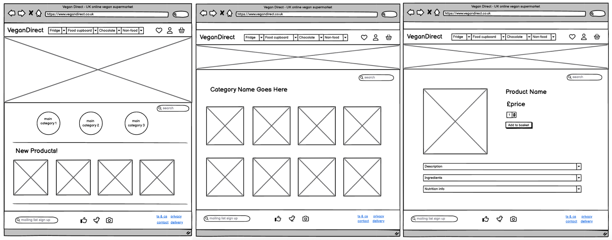

- Homepage: with large banner image, then images and links to product categories below
- Category page: products listed by category in card form
- Product page: with individual product details - name, photo, price and 'add to basket' at the top of the page,
and further details below

### Visual design choices

**Colour scheme**

Colour scheme

The colour palette was chosen using the colour scheme generator [coolors.co](https://coolors.co/d81159-8f2d56-218380-fbb13c-73d2de), with the aim of achieving a modern but friendly feel.

The site primarily uses black text and off-white background to add a modern feel, with colours added to the navbar, buttons and info banner across the homepage to attract the user's attention.  

Colours used:
- #fbb13c Hunyadi yellow: Navbar and ‘more info/action’ buttons
- #218380 Teal: ‘Add to basket’ buttons
- #73d2de Non Photo blue: info banner on homepage (changed from raspberry #ee3378 to meet usability contrast requirements), and hover colour for ‘add to basket’ buttons
- #8F2D56 Quinacridone Magenta: combined with images in the carousel banner on the homepage

Care was taken to make sure sufficient contrast between text and background for accessibility purposes.

As a personal preference, I chose not to go with the stereotypical green which is often associated with vegan and vegetarian food. I personally find that association a bit old-fashioned as it has been in use for so long, so it feels harder to convey a modern, exciting feel using green colours.  Green also has connotations of 'healthy/vegetables', which is not necessarily accurate for much of the product range of this store.

**Fonts**

Fonts used were Kaushan Script regular for the site’s logo/h1 and Rubik 
(various styles) for the other headings, buttons and menu bars.

- Logo/Page heading: Kaushan Script

- Carousel headings: Rubik bold

- Carousel text: Rubik regular

- Homepage subheadings (above the circular images): Rubik Medium

- Menu bar: Rubik medium

- Buttons: Rubik medium

I kept the font as Bootstrap’s default native font stack (https://getbootstrap.com/docs/5.0/content/reboot/#native-font-stack) which chooses apple system on Mac, Roboto on Android and Segoe UI for Windows. This already looked in keeping with the overall feel of the site and the fonts have been pre-selected for optimum readability on various devices.

## Features

The webshop comprises the following pages and features:

### Main pages (no log in required)

**Homepage and Navbar (navbar is consistent across the whole site)**

  First impressions:
  - User is welcomed to the site with eye-catching carousel banner images directing them to 
the New Products section and a featured brand (these would be changed regularly according to where the retailer
  wishes to direct the customers' attention)
  - Site name/logo clearly visible in the top left so visitors know where they are
  - Attractive circular photos and headings guiding customers to the main categories to browse
  - Brightly coloured buttons and navbar to draw the user's attention to where to go next
  - Extra homepage banner drawing the customer's attention to important information that acts as additional selling points for this site (free delivery threshold, 100% vegan product range, vegan-owned business)
  
  Navbar:
  
  - Drop-down menus with the main categories and subcategories of products (all products on the site are included in at least
  one of these main categories)
  - Search box for free text search across the whole site
  - 'Login/Account' icon (which changes text depending on whether or not the user is logged in)
  - 'Basket' icon (the number of items in the basket is shown underneath - another option would be to show a running total here
  but I felt it might discourage customers from adding more items to their basket)

  Below the fold:
  - 'Welcome' text with a brief description of what the webshop is/does (including appropriate keywords for SEO)
  - 'New Products' and 'Bestsellers' section to guide the user towards selections of popular products if they need a
  starting point. Both these sections are populated by four randomly chosen products from each section (which changes on each
  reload of the page) and link through to a page showing all products in the category.  These sections could also be changed over time
  depending on which products the store owner wishes to bring to the attention of customers (for example seasonal products could be added as needed).

**Homepage:**

**Categories page (lists of products by category)**
  - Category name as page header, plus a helpful descriptive paragraph incorporating some SEO keywords
  - Products belonging to each category (either top level or subcategory) are displayed using Cards, with
  product photo (and category) above and name, price, brand, quantity selector and add to basket button below.
  - Users can click through to see more detail about an individual product, click the 'brand' to view all products by that brand
  or quick-add the product to their basket
  - The 'sort by' button on the right allows users to sort the products lists A-Z, Z-A, price low-high and price high-low
  - The top-level category pages (not shown here) include yellow buttons linking to the subcategories to help the customer narrow down their browsing if wished
  - A small breadcrumb menu on subcategory pages tells the user which main category they are currently within

**Category page (subcategory):**

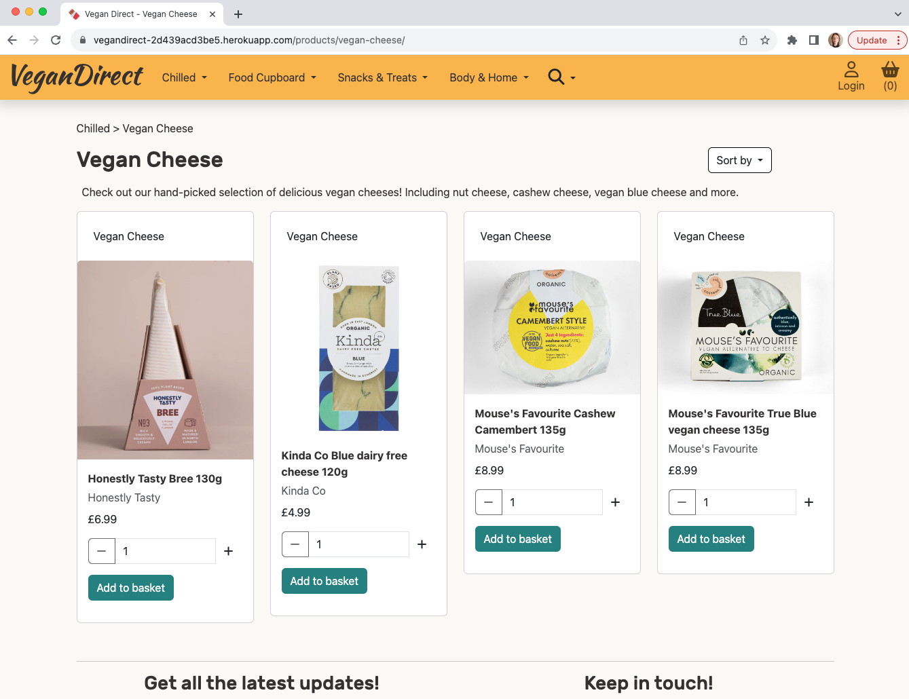

**Product page (individual product details)**

- The top half of the page includes the main information: product photo, name, brand, price,
quantity selector, add to basket button, labels which appear if the product is organic or gluten-free

- Lower down the page, the additional details are contained in accordions for the customer to view if they wish:
ingredients, description, nutrition information, brand info

- At the bottom of the page is a 'products you might also like' section, which shows four randomly selected products
which belong to one of the same categories as the product the user is viewing. (The products in the screenshot are all also in the 'Bestsellers' category,
but I have chosen to only display one of the product's categories on the product card to avoid clutter.)

**Product page:**

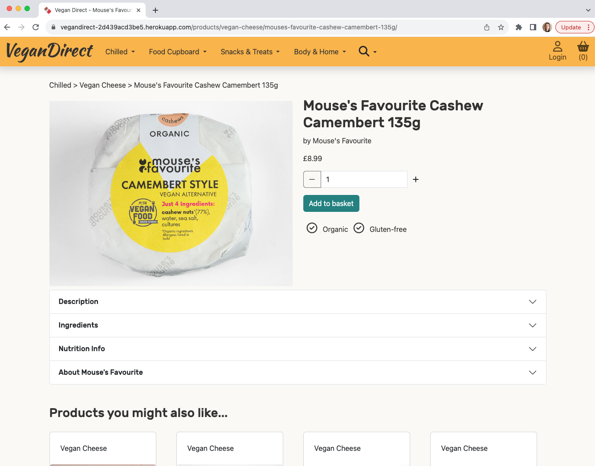

**Products you might also like... section of product page:**

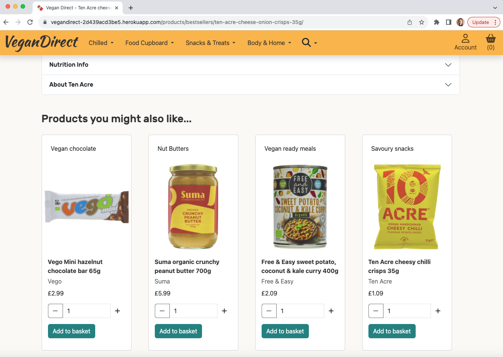

**Brand page**

- This page displays the name of each brand, a descriptive paragraph, and a list of all products available by that brand

**Brand page:**

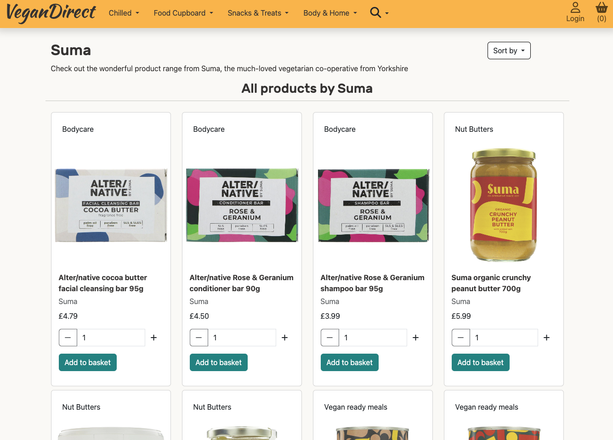

**Basket**

- Items appear to the basket as the customer adds them.
- Includes the product name (which is a link back to the product page), price per item, quantity added, and subtotal for each item (for if the customer has ordered more than one)
- Customer can update the quantity by using the quantity selectors and then clicking 'update', or remove products using the 'remove' button
  (I have not added a confirmation message here as I expect customers will want to remove the product without any extra steps or popups in this case)
- A dynamically updated message appears once the order total goes over £20, showing how much more the customer would need to spend to qualify for free delivery (in red to imply urgency).
The free delivery threshold is also included prominently as a prompt.
- The basket totals are updated as the customer adds products or edits their basket contents
- A cool box is automatically added to any order containing a chilled item (as these would need to be sent out with insulation/ice packs, which costs the retailer more to post)
- 'Checkout' button clearly visible in a different colour to the rest of the page

**Shopping basket:**

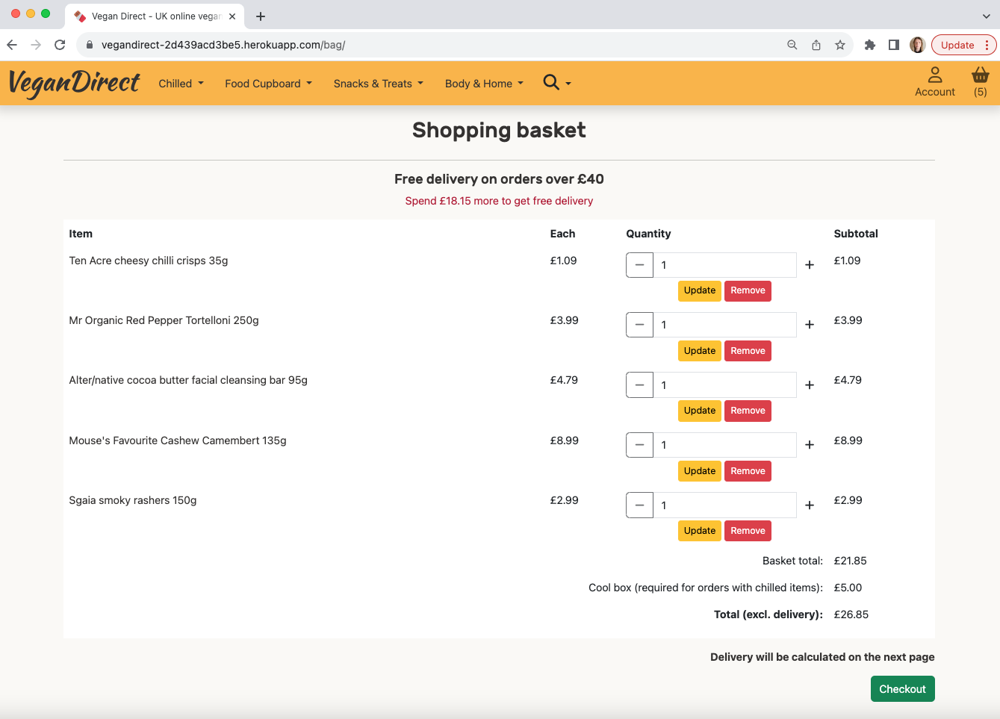

**Checkout page**

- Address form: this is pre-populated if the customer is logged in and has a preferred address saved, if not the form is blank for customers to fill in
- Logged-in customers can select another of their saved addresses if they have more than one. There is also a 'clear form' link for if the customer wishes to add a new address.
- Customers who are not logged in are shown a links to 'Login to use your saved addresses, or Create an account to save your details' to show users the benefits of creating an account and encourage them to do so
- Order summary shows the customer what they are about to buy, and the delivery cost, cool box charge if there is one, and total amount 
- The Payment box is provided by Stripe, which means the payment is taken securely and the card details do not come into contact with the webshop itself 
(this has the added benefit that the retailer does not have to comply with the associated security requirements needed to handle card details, as Stripe takes care of this)

**Checkout:**

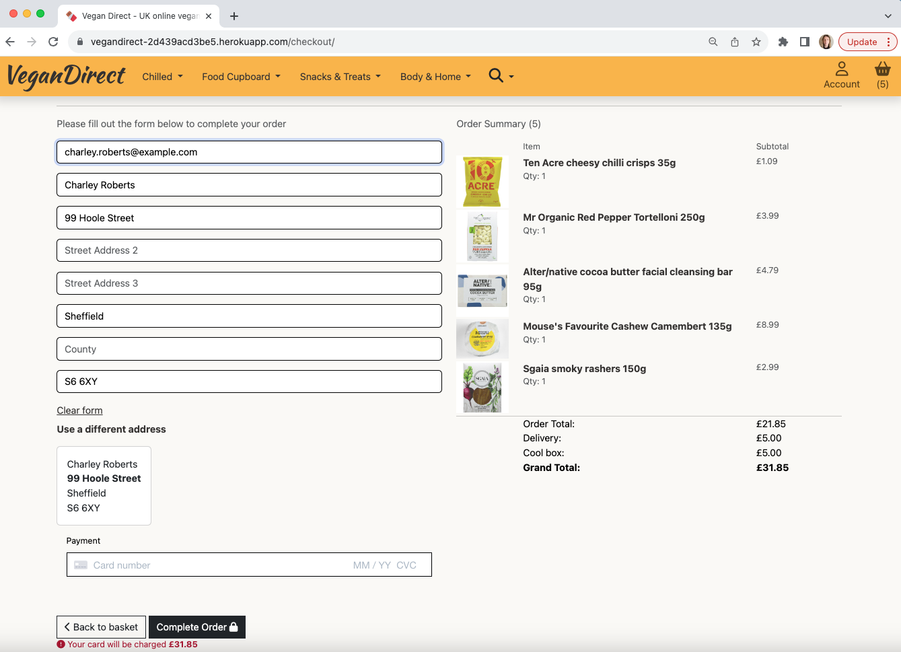

**Order confirmation page**

The customer arrives at this page to confirm to them that their order has been sent and confirm the details.
The customer also receives an automated email containing the same details.  
If the customer has already created an account and was logged in to make the purchase, they can view the same details in the 'order history' section under 'My account'

**Order confirmation page:**

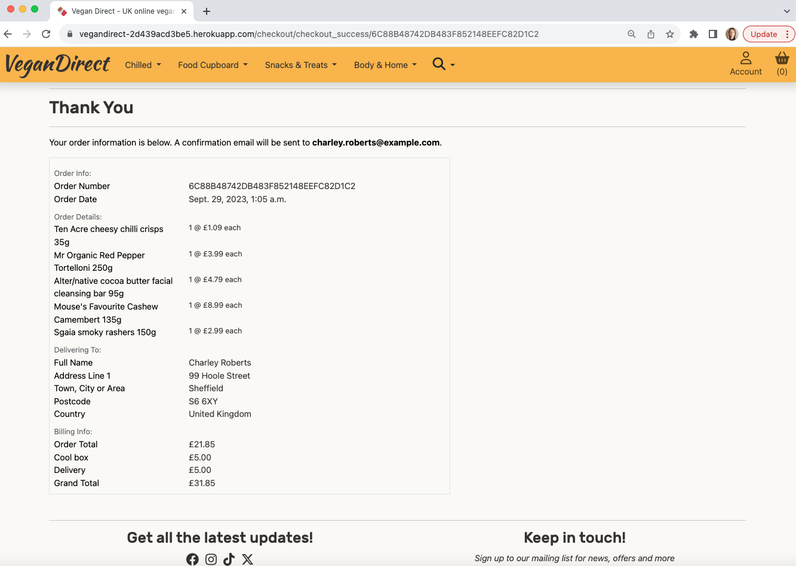

### Customer account pages

Pages include:

- Create account
- Login
- Logout

- 'My account' section
 
  - My addresses
    - Add address
    - Edit address
  - Email addresses
  - Order history

**Features include**:

- Create a customer account
- Log in and out
- Sign in using Google account
- Add new delivery address
- Select preferred address (which pre-populates) the checkout page if the user is logged in
- Edit or remove addresses
- Add a new email address
- Select primary email address
- Remove email address if customer has more than one
- View customer's order history

### Retailer dashboard pages

- Dashboard panel
  - View all products 
  - Add product
  - Edit product
  - Add brand
  - Edit brand

**Features include:**
- Custom forms for retailers to add, edit and delete products and brands
without using the Django admin panel
- View a list of all products in the database with their wholesale and retail prices
- 'Edit this product' button on individual product pages, so logged-in store 
owners can quickly edit a product if they are browsing the site and find something that needs updating

**Retailer dashboard landing page:**

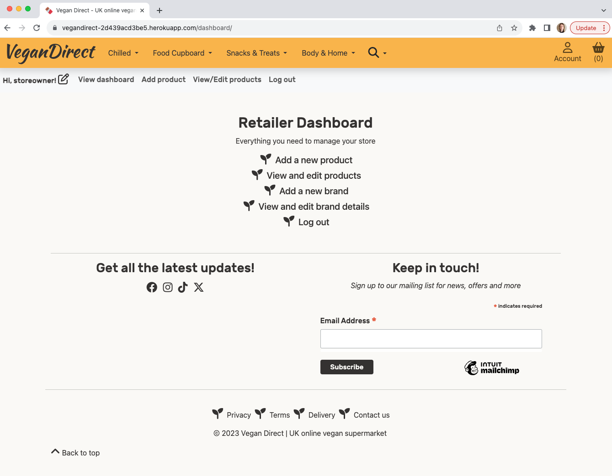

### Features for future iterations

As this was only the first release of the MVP (minimum viable product), there are 
many possibilities for extending this project and adding to its features. Some examples are:

**For customers:**

- Loyalty points: a facility to earn loyalty points with each purchase, and redeem them for a discount on future orders
- Favourites/wishlist: the ability to mark products as 'favourites', either to come back and buy them more quickly in future, 
or to create a shortlist of products to choose from for the customer's current order, or to remember for next time
- The ability to filter products or search results by property such as gluten-free, organic, free from certain allergens
- A facility to leave product reviews (possibly one which store owners can choose whether to enable or disable, 
as sometimes reviews are more trouble than they're worth to business owners!)

**For retailers:**

- Statistics dashboard showing information such as:
  - number of each product sold
  - products ranked by popularity (by numbers sold, total income or margin)
  - sales data that could be transferred into the business's bookkeeping software
  - data on VAT (sales tax) collected to transfer onto the business's VAT Return
- Ability to bulk upload product data, e.g. using a CSV file (particularly for when 
  signing up with a new wholesaler, or when the wholesalers put all their prices up in one go at the beginning of a year)
- Ability to switch individual products between 'published' and 'draft' mode, so the store owner can remove
products from the webshop without needing to delete the information 
(e.g. seasonal products the retailer might want to sell again next year)
- Easier access to adjust other pricing information such as the free shipping threshold and delivery costs
- Adding a greater range of delivery options for customers to choose from

## Marketing 

As a B2C business, VeganDirect would be aiming to reach individual consumers. One important way of doing this is through SEO.
The content of the site was written with keywords in mind, with the aim of being sure to include important keywords in the page content, 
page titles, meta tags in the header, without drifting into 'keyword stuffing'.

### Vegan (or similar term) + type of product = search result

Customers are likely to be searching for terms such as (obviously) vegan, and similar equivalents including
'plant-based', 'cruelty-free', 'animal-free' - usually in conjunction with the type of product they're searching for,
so 'vegan chocolate', 'plant-based ready meals', 'cruelty-free shampoo', 'animal-free laundry liquid'.
Including plenty of keywords for the types of products found on the site is helpful, such as including a descriptive paragraph
under each category heading.

Including descriptive text containing keywords is particularly useful for vegan products, as due to food labelling laws in the UK and EU,
many terms cannot be used in the name of the products themselves, such as 'sausages', 'milk', 'cheese'.  However, users' search terms don't work 
like this - the customer will be searching for "vegan bacon", not "plant-based smoky rashers made from wheat gluten", or whatever the manufacturers themselves
are allowed to say on their packaging, so descriptions added by webshops become even more useful.

**Other SEO strategies**

"FAQ" pages:

An additional approach would be to give each category an "FAQ" section, where the 'questions' take the form of
suggested Google searches: for instance, 'why isn't dark chocolate vegan?', 'does vegan cheese melt?', 
'what do vegans eat instead of bacon'. This seems to be a fairly common approach with various online shops I viewed
in the preparation for this project.  'Questions' can be generated by entering a relevant search into Google and 
looking at the alternative searches it suggests.

Google Shopping results:

Another possibility for online shops is to get some of their individual products listed in Google's shopping results, 
so that the shop's name appears in the search results when users search for a specific product.

**Facebook page**

Social media is undoubtedly an essential tool for getting the word out about small businesses such
as VeganDirect, connecting with their community and attracting customers to the store.  I created a Facebook page which (at the time of 
writing) is live at [www.facebook.com/vegandirectuk](https://www.facebook.com/vegandirectuk), or see screenshots below:

[Facebook screenshot (public view)](doc/Facebook-page-public-view.pdf)

[Facebook screenshot (admin view)](doc/Facebook-page-admin-view.pdf)

## Checkers (HTML/CSS/Python)

### HTML

https://validator.w3.org/ was used for HTML checking. 

The category, product and brand pages all use one template each, so only one example of each page
needs to be passed through the checkers.  The checkers are only able to see pages which do not require a login.

The following pages were passed through the validator:

Homepage: https://vegandirect-2d439acd3be5.herokuapp.com/

Category page: https://vegandirect-2d439acd3be5.herokuapp.com/products/chilled/

Product pgae: https://vegandirect-2d439acd3be5.herokuapp.com/products/chilled/honestly-tasty-bree-130g/

Brands page: https://vegandirect-2d439acd3be5.herokuapp.com/products/brands/suma/

Search results page: https://vegandirect-2d439acd3be5.herokuapp.com/products/?q=suma

Basket: https://vegandirect-2d439acd3be5.herokuapp.com/bag/

Checkout: https://vegandirect-2d439acd3be5.herokuapp.com/checkout/

Create an account: https://vegandirect-2d439acd3be5.herokuapp.com/accounts/signup/

Log in: https://vegandirect-2d439acd3be5.herokuapp.com/accounts/login/

After some reformatting, the only remaining warning the HTML checker produces is 
that it doesn't like me using h1 tags for the name of my page (on the top left of the navbar). 
As this is effectively the heading for all pages, I consider that h1 tags are suitable here.

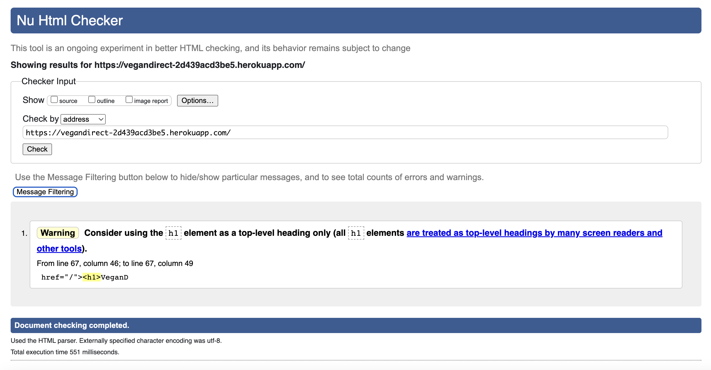

### CSS checker

https://jigsaw.w3.org/css-validator/ was used to check the CSS file.  The only warnings it produced
were about Bootstrap's CSS and none about any of my own CSS.

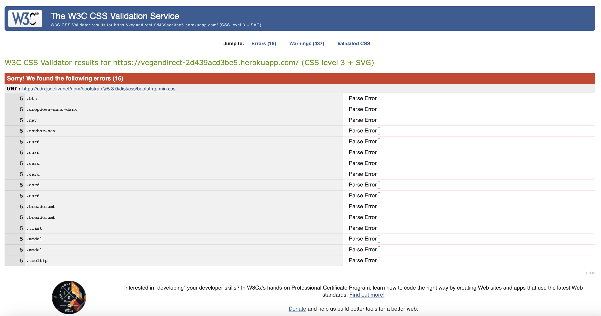

### Python checking

Flake8 was used (run locally on my IDE) to check the Python code. Code was first formatted using
[Black](https://black.readthedocs.io/en/stable/), set to a line length of 79 characters to match the default
setting of Flake8.  Flake8 was then installed using `pip install flake8`
and run using the command `flake8 --exclude=venv,migrations`
(which excludes third-party packages in my virtual environment and automatically-generated migrations files).

After some editing, the remaining errors were related to files which were automatically generated by
Django when apps were created that hadn't been used in this project (which I chose not to delete in case 
they might be needed in future) and some single lines of code such as secret keys which cannot be broken into 
smaller parts without risking breaking the site: [View flake8 messages](doc/flake8.txt)

### Accessibility checking

The Lighthouse checker was also used for accessibility scores, please see the 
'testing' spreadsheet below for pages tested and results (in summary: all 
public pages scored between 98 and 100).

## Testing

I carried out a range of manual testing covering:
- Links from each page
- Responsiveness of each page on each of the following devices: 
  - iPhone8 portrait mode
  - iPhone8 landscape mode
  - iPad portrait mode
  - iPad landscape mode
  - MacBook Air 13 inch screen
  - Large desktop screen 1920x1080
- Functionality on each page
- For functionality involving user inputs or URLs, how could someone break it and what happens if they try

The tests and results can be [viewed in this spreadsheet](https://docs.google.com/spreadsheets/d/1Hpw9LP2QTGu5egdi-UiwWGQVMrsxtEennVOvIz3wpPA/edit#gid=0).

### Unfixed bugs

1. The default 'up/down' arrows are still present in the quantity field, even though we do not want them as we have increment/decrement buttons either side of it for the user to change the quantity.  These arrows have proved difficult to remove so far.

2. Each view only has one redirect url. Some pages with edit functionality can be navigated to from several places - notably the 'create an account' page, which can be accessed from the navbar and from a link on the checkout page, and the 'edit product' link for store owners, which can be accessed from a list of all products within the retailer dashboard or through an 'edit this product' button on the individual page.

    The result of this is that the user is not in all cases redirected back to the page from which they arrived.  In particular, users accessing the 'create an account' feature from the link on the checkout page are then redirected to the 'my account' page rather than back to their checkout page, meaning they have to navigate themselves back to the checkout via the basket.  Allowing multiple redirects depending on where the user arrived from is something to look at in a future iteration.

3. The 'Products you might also like...' section on the individual product page sometimes includes the same product the user is looking at. This could either be eliminated through code or would become less likely to occur once more products were added to the database.
It also currently uses all categories a product belongs to, which in some cases includes 'New Products' or 'Bestsellers', so it is not always immediately obvious why particular products have been selected for inclusion in this section.

4. The individual product cards only display one category that the product belongs to (as more than one looks too cluttered), which is currently the first category found in its record.  Which category comes first depends on the order in which the categories were created.
So some products show 'bestsellers' as their category rather than 'savoury snacks', for instance. I decided there was no harm in mentioning that a product was New or a Bestseller, so have left it as is, but a neater solution could be identified in future to allow for more 
consistency in the way product information is displayed across different sections of the site.

## Deployment steps

Prerequisites: Python (version 3.11 used for this project)

Installs: Django (version 4.2.1 used for this project)

IDE: PyCharm was used for this project

**Initial setup**

- Create the initial files in GitHub and IDE
- Add files to `.gitignore`
- Create and activate virtual environment in PyCharm
- Add django dependency to `requirements.txt` and install it
- Create the project with `django-admin startproject`

[See detailed steps here](doc/deployment-1.txt)

**Deployment once the project has been created**

- Create a Heroku app

- Create a Postgresql database
  - (Note: My original intention was to use ElephantSQL, but the version of PostgreSQL
    provided by their free tier is not compatible with the version of Django I am using.
    I didn't realise this until the project was well underway, so I have
    chosen to use Heroku's database service for my project as I would have had to pay for
    ElephantSQL anyway)

- Set up hosting for static and media files using AWS S3

- Deploy to Heroku (and set up automatic build updates from GitHub if wished)

[Setting up AWS S3](doc/s3.txt)

[Deployment to Heroku](doc/heroku.txt)

There are a couple of final steps: 
- Registering Stripe webhooks
- Configuring the sending of automated confirmation emails

[Final deployment steps details](doc/final-deployment-steps.txt)

## Technologies used

**Languages and frameworks:**

Python (3.11)

Django (4.2.1)

HTML

CSS

JavaScript

[Bootstrap 5](https://getbootstrap.com/)

[django-bootstrap5](https://pypi.org/project/django-bootstrap5/)

**Tools:**

[Stripe](https://stripe.com/gb) for payment processing

[AWS S3](https://aws.amazon.com/) for image hosting

Gmail app passwords to enable email sending

[Heroku](https://www.heroku.com) to host the deployed version

[Github](https://github.com/) for version control and Github Projects for Agile development

Local version created in PyCharm (IDE)

https://www.xml-sitemaps.com/ for sitemaps

[Mailchimp](https://mailchimp.com/) for the mailing list sign up form

**Design tools:**

[Fontawesome](https://fontawesome.com/) for icons

[Font Squirrel](https://www.fontsquirrel.com/) for fonts

[Favicon.io](https://favicon.io/) to generate the favicon

[Figma](https://www.figma.com/) to create the homepage banner images

[Coolors.co](https://coolors.co/) to select the colour scheme

## References and Credits

### Tutorials

Code Institute Boutique Ado walkthrough videos (within CodeInstitute course material)

### Code

**Code copied from the Boutique walkthrough project:**

The ‘checkout’ app was copied from Boutique Ado and modified. Some code in the ‘Bag’ app was copied from Boutique Ado (with comments). 

**Bootstrap templates:** 

[Carousel template](https://getbootstrap.com/docs/5.3/examples/carousel/) (used on homepage with modifications, and some code taken from this for the base template)

[Cards](https://getbootstrap.com/docs/5.3/components/card/) (to display product info in categories) 

[Dropdown Navbar](https://getbootstrap.com/docs/5.3/components/navbar/) 

[Accordion](https://getbootstrap.com/docs/5.3/components/accordion/) (on individual product pages)

**[Mailchimp](https://www.mailchimp.com)** for the mailing list sign up form template code (adapted)

**[django-bootstrap5](https://pypi.org/project/django-bootstrap5/)** for form styling 

### Documentation 

**[The Django documentation](https://docs.djangoproject.com/en/4.2/)** was frequently referred to throughout the development of this project

In particular the following pages:

[Model fields](https://docs.djangoproject.com/en/4.2/ref/models/fields/)

[Django default User model](https://docs.djangoproject.com/en/4.2/ref/contrib/auth/)

[Selecting the first item in a field (e.g. to display the first category a product belongs to, not all of them)](https://docs.djangoproject.com/en/4.2/ref/models/querysets/#first)

[QuerySet .exists()](https://docs.djangoproject.com/en/4.2/ref/models/querysets/#django.db.models.query.QuerySet.exists) (used in context.py in the Bag app to determine whether or not the basket contains any chilled products)

[Django Allauth documentation](https://django-allauth.readthedocs.io/en/latest/index.html)

[Django-bootstrap5 form field styling](https://django-bootstrap5.readthedocs.io/en/latest/templatetags.html#bootstrap-field)

### Media

**Product data/images**

All images and data used  in the product listings are made publicly available by the manufacturers for stockists to use.
Most are borrowed from [Suma Wholesale](https://wholesale.suma.coop/) and some from [veganwholesaler.com](https://veganwholesaler.com/)

**Homepage images**

Cheese banner photo from [Mouse's Favourite](https://mousesfavourite.com/)

Banner product images from [Suma Wholesale](https://wholesale.suma.coop/) (and compiled by me)

Circle images from: 
1.	Mouse’s Favourite 
2.	Suma Wholesale
3.	[Vego](https://vego-chocolate.com/) 
4.	[Faith in Nature](https://www.faithinnature.co.uk/)

**Privacy policy text**

This was taken from one of the webshops I used to manage when I owned a retail business (site no longer active)

**Terms and conditions of service text**

This was borrowed from [VeganStore.co.uk](https://www.veganstore.co.uk/)

### And finally...

This project was aided by my previous experience from six years as an 
independent retail business owner, including the use of two different software 
packages (Airpos and Foodcommerce) for managing in-store, click & collect and home delivery purchases.

